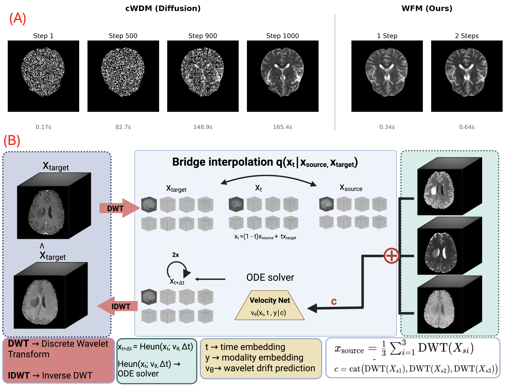

# WFM: 3D Wavelet Flow Matching for Ultrafast Multi-Modal MRI Synthesis

[](https://opensource.org/licenses/MIT)
[](https://openreview.net/forum?id=DTaXg5kBGm)

Official PyTorch implementation of **WFM: 3D Wavelet Flow Matching for Ultrafast Multi-Modal MRI Synthesis** by Yalcin Tur, Mihajlo Stojkovic, and Ulas Bagci (MIDL 2026).

## Abstract

Diffusion models have achieved remarkable quality in multi-modal MRI synthesis, but their computational cost—hundreds of sampling steps and separate models per modality—limits clinical deployment. We observe that this inefficiency stems from an unnecessary starting point: diffusion begins from pure noise, discarding the structural information already present in available MRI sequences. We propose WFM (Wavelet Flow Matching), which instead learns a direct flow from an *informed prior*—the mean of conditioning modalities in wavelet space—to the target distribution. Because source and target share underlying anatomy and differ primarily in contrast, this formulation enables accurate synthesis in just 1-2 integration steps. A single 82M-parameter model with class conditioning synthesizes all four BraTS modalities (T1, T1c, T2, FLAIR), replacing four separate diffusion models totaling 326M parameters. On BraTS 2024, WFM achieves 26.8 dB PSNR and 0.94 SSIM—within 1-2 dB of diffusion baselines—while running 250-1000× faster (0.16-0.64s vs. 160s per volume).

<p align="center">
  
</p>

## Key Features

- **Ultrafast inference**: 1-2 steps vs. 1000 steps for diffusion (250-1000× speedup)
- **Unified model**: Single 82M-parameter model for all 4 BraTS modalities
- **Informed prior**: Starts from mean of available modalities, not pure noise
- **Wavelet space**: Memory-efficient 3D processing via Haar DWT

## Installation

We recommend using [conda](https://github.com/conda-forge/miniforge) to install dependencies:

```bash
conda env create -f environment.yml
conda activate cwdm
```

Or using pip:

```bash
pip install -r requirements.txt
```

## Training

To train a unified WFM model on BraTS data:

```bash
python scripts/train_wfm.py \
    --data_dir /path/to/brats/train \
    --batch_size 4 \
    --max_iterations 50000 \
    --contr all \
    --lr 1e-5 \
    --save_interval 10000 \
    --log_interval 100 \
    --use_tensorboard True \
    --tensorboard_path ./runs/wfm_unified
```

Key arguments:
- `--contr all`: Train unified model for all modalities (default)
- `--contr t1n/t1c/t2w/t2f`: Train single-modality model
- `--sigma_max 0.5`: Maximum noise level in forward process

## Sampling

To synthesize missing modalities:

```bash
python scripts/sample_wfm.py \
    --data_dir /path/to/brats/validation \
    --model_path ./runs/wfm_unified/checkpoints/wfm_unified_050000.pt \
    --output_dir ./results \
    --sampling_steps 1 \
    --contr all
```

Key arguments:
- `--sampling_steps 1`: Direct prediction (fastest)
- `--sampling_steps 10-50`: Multi-step Euler integration (higher quality)
- `--contr all`: Synthesize all modalities

## Data

The code expects BraTS data in the following structure:

```
data/
└── BRATS/
    └── training/
        └── BraTS-GLI-00000-000/
            ├── BraTS-GLI-00000-000-t1n.nii.gz
            ├── BraTS-GLI-00000-000-t1c.nii.gz
            ├── BraTS-GLI-00000-000-t2w.nii.gz
            └── BraTS-GLI-00000-000-t2f.nii.gz
        └── BraTS-GLI-00002-000/
        ...
```

## Method

WFM learns a velocity field that transports from an informed prior to the target:

**Forward process:**
```
x_t = (1-t)·x_source + t·x_target + σ√(t(1-t))·ε
```

**Training objective (Eq. 3):**
```
L = E[||f_θ(x̃_t, c, t, y) - (x_target - x_source)||²]
```

where `x_source` is the mean of conditioning modalities in wavelet space.

## Citation

If you find this work useful, please cite:

```bibtex
@inproceedings{tur2026wfm,
    title={WFM: 3D Wavelet Flow Matching for Ultrafast Multi-Modal MRI Synthesis},
    author={Tur, Yalcin and Stojkovic, Mihajlo and Bagci, Ulas},
    booktitle={Medical Imaging with Deep Learning (MIDL)},
    year={2026}
}
```

## Acknowledgements

This codebase builds upon:
- [cWDM / wdm-3d](https://github.com/pfriedri/wdm-3d) by Paul Friedrich et al. (MIT License)

## License

This project is licensed under the MIT License - see the [LICENSE](LICENSE) file for details.
